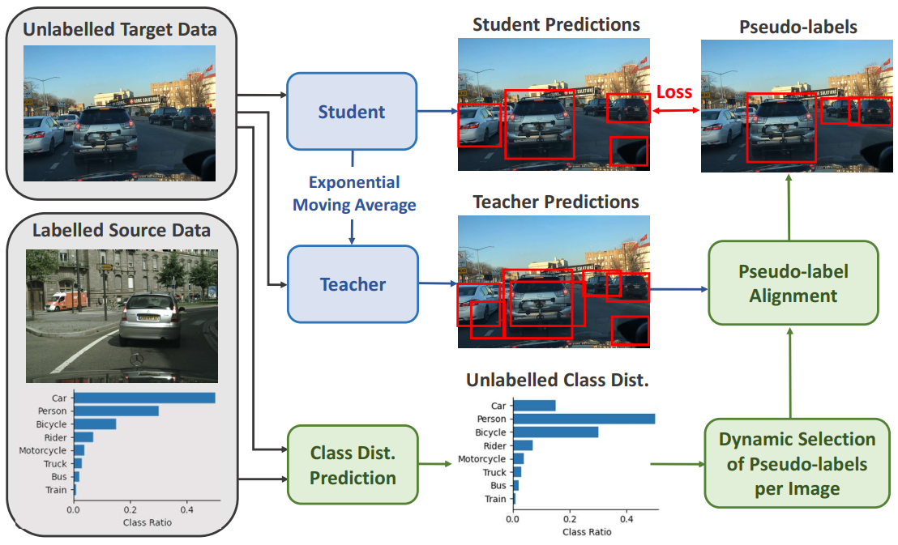
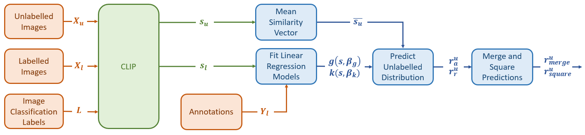

# About Me
Hi, I'm Nic, a PhD student with the QUT Centre for Robotics. I am interested in using robots and artificial intelligence to improve the sustainable management of Australia’s natural resources. My current research aims to leverage readily available unlabelled data to improve robotic vision systems when things in the environment change. Robots deployed in the real world will regularly encountered scenarios that differ substantially from what was encountered during development. Ideally, the robot should be able to learn from these novel experiences and improve itself without human intervention. My work is exploring new ways of achieving this, with particular emphasis on using 'common sense' prior knowledge to guide unsupervised learning.

# Unsupervised Domain Adaptive Object Detection
Object detection is a crucial component of many robotic systems, from self-driving cars to service robots. Existing object detectors based on deep learning require the collection of large, annotated datasets for training. However, in openworld deployment a robot will encounter changes in object appearance due to factors such as weather, lighting conditions, or image corruptions. Furthermore, shifts in a robot’s deployment environment can impact the likelihood that different objects will occur, termed class distribution shift. Due to the high costs of annotation, it is infeasible to gather labelled data for all potential conditions and environments. Thus, it is inevitable that an object detector deployed on a robot will face the problem of domain shift, where the images being processed do not match those used for training.
Unfortunately, the performance of deep learning-based object detectors degrades significantly when facing such domain shift. To address this issue, Unsupervised Domain Adaptive Object Detection (UDA-OD) has been proposed to adapt a model from a known source domain to a shifted target domain using only unlabelled data. This strategy can help the model generalise and improve its performance in the target domain, without the need for expensive labelling.

# Class Distribution Prediction for Reliable Domain Adaptive Object Detection

## Motivation

Previous approaches to UDA-OD based on self-training have been effective in overcoming changes in the general appearance of images. However, shifts in a robot's deployment environment can also impact the likelihood that different objects will occur, termed class distribution shift. Motivated by this, we propose a framework for explicitly addressing class distribution shift to improve pseudo-label reliability in self-training. See the [repository](https://github.com/nhcha6/ClassDistributionPrediction) for implementation details, and the [paper](https://arxiv.org/pdf/2302.06039.pdf) for extensive experiments. 

## Our Approach

As per the standard implementation of Mean Teacher, confident detections from a teacher model are used as pseudo-labels to train a student model using unlabelled data. The Exponential Moving Average (EMA) of the weights of the student are then used to update the teacher to make it more stable during training. Traditionally, a static confidence threshold is defined for all classes to generate pseudo-labels. Our method (shown in green) instead predicts the class distribution of the unlabelled data, and selects confidence thresholds to align the class distribution of the pseudo-labels with this prediction. To further address the poor performance of the teacher model in the target domain, we dynamically adjust the number of pseudo-labels per image as teacher confidence increases.

The below figure shows our proposed method for predicting the class ratio of the unlabelled data. CLIP is used to calculate the similarity between the labelled images $X_{l}$ and a series of image classification labels $L$ of the form ``a photo of class $c$". Using the labelled similarity vector $s_{l}$ as a domain invariant representation of semantic context, two linear regression models are fit to predict the number of instances $g(s, \beta_{g})$ and the class ratio $k(s, \beta_{k})$ in each labelled image. To make a prediction for the class ratio of the unlabelled images $X_{u}$, CLIP is used to extract the similarity vectors $s_{u}$. The mean similarity vector $\overline{s_{u}}$ is then calculated and input to the linear regression models to generate two distinct predictions for the class ratio of the entire unlabelled dataset. These predictions are merged by calculating the geometric mean, and the relative change in class ratio squared to account for persistent underestimation.

<!--
**nhcha6/nhcha6** is a ✨ _special_ ✨ repository because its `README.md` (this file) appears on your GitHub profile.

Here are some ideas to get you started:

- 🔭 I’m currently working on ...
- 🌱 I’m currently learning ...
- 👯 I’m looking to collaborate on ...
- 🤔 I’m looking for help with ...
- 💬 Ask me about ...
- 📫 How to reach me: ...
- 😄 Pronouns: ...
- ⚡ Fun fact: ...
-->
